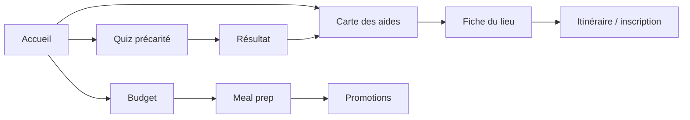
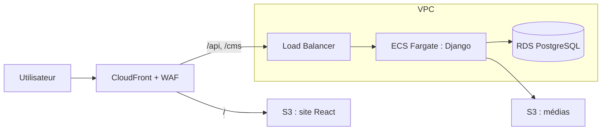

# PFE — Cabas 🧺

Projet de fin d'études sur la précarité alimentaire étudiante.

**Cabas** est une application web (puis mobile) qui aide les étudiants d'Île-de-France à trouver les aides alimentaires près de chez eux et à bien manger avec un petit budget.

---

## Sommaire

0. [Bien démarrer avec Git](#0-bien-démarrer-avec-git)
1. [Le projet](#1-le-projet)
2. [Cahier des charges](#2-cahier-des-charges)
3. [Architecture technique](#3-architecture-technique)
4. [Organisation Git](#4-organisation-git)
5. [Workflow de travail](#5-workflow-de-travail)
6. [Conventions de commit](#6-conventions-de-commit)
7. [Règles d'équipe](#7-règles-déquipe)
8. [Sources](#8-sources)

---

## 0. Bien démarrer avec Git

### Installer Git

- **Windows** : télécharger sur [git-scm.com](https://git-scm.com/downloads) (garder les options par défaut, ça installe aussi *Git Bash*).
- **macOS** : `xcode-select --install` dans le terminal, ou `brew install git`.
- **Linux** : `sudo apt install git`.

Vérifier que c'est installé :

```bash
git --version
```

### Configurer son identité (une seule fois)

Ces infos apparaissent sur chacun de tes commits. Utilise **le même e-mail que ton compte GitHub** :

```bash
git config --global user.name "Prénom Nom"
git config --global user.email "ton.email@exemple.com"
git config --global init.defaultBranch main
```

### Avoir accès au dépôt

1. Créer un compte sur [github.com](https://github.com) si ce n'est pas déjà fait.
2. Envoyer son pseudo GitHub à l'équipe pour être ajouté comme **collaborateur** du dépôt [Jachriso/PFE](https://github.com/Jachriso/PFE).
3. Accepter l'invitation reçue par e-mail (ou dans les notifications GitHub).

### Cloner le projet

Cloner = télécharger le dépôt sur ton ordinateur, avec tout son historique. Place-toi dans le dossier où tu veux ranger le projet, puis :

```bash
git clone https://github.com/Jachriso/PFE.git
cd PFE
```

> 💡 À la première commande `push`, GitHub te demandera de te connecter. Sur Windows, une fenêtre de connexion s'ouvre automatiquement. Sinon, crée un **token** dans *GitHub → Settings → Developer settings → Personal access tokens* et utilise-le à la place du mot de passe.

> ⚠️ Évite de cloner le projet dans un dossier synchronisé (OneDrive, Google Drive, iCloud) : la synchronisation peut corrompre le dossier `.git`. Préfère par exemple `C:\dev\` ou `~/dev/`.

### Récupérer la branche `dev`

Après le clone, tu es sur `main`. Comme tout le travail part de `dev` :

```bash
git checkout dev
git pull origin dev
```

Vérifier où tu en es à tout moment :

```bash
git status        # sur quelle branche je suis, quels fichiers ont changé
git branch -a     # liste des branches locales et distantes
git log --oneline # historique des commits
```

### Créer ta première branche

```bash
git checkout -b feature/front-page-accueil-prenom
```

Ensuite, suis le [workflow de travail](#5-workflow-de-travail) 👇

### Les commandes à connaître

| Commande | À quoi ça sert |
|---|---|
| `git clone <url>` | Télécharger le dépôt la première fois |
| `git status` | Voir l'état de ses fichiers et sa branche actuelle |
| `git checkout <branche>` | Changer de branche |
| `git checkout -b <branche>` | Créer une branche et s'y placer |
| `git pull` | Récupérer les dernières modifications du dépôt distant |
| `git add <fichier>` / `git add .` | Préparer des fichiers pour le prochain commit |
| `git commit -m "message"` | Enregistrer les modifications préparées |
| `git push` | Envoyer ses commits sur GitHub |
| `git merge <branche>` | Intégrer une autre branche dans la branche actuelle |
| `git stash` / `git stash pop` | Mettre de côté ses modifs pour changer de branche, puis les récupérer |

> 💡 Si tu préfères une interface graphique : l'onglet *Source Control* de VS Code ou [GitHub Desktop](https://desktop.github.com) font tout ça en quelques clics.

---

## 1. Le projet

### Pourquoi ?

Un questionnaire mené en septembre 2026 auprès de 151 étudiants montre que :

| Constat | Chiffre |
|---|---|
| Ne connaissent aucune aide alimentaire près de chez eux | **74 %** (28 sur 38 répondants à la question) |
| Ont déjà eu recours à une aide | 18,5 % |
| Frein n°1 : manque d'infos sur les lieux et dates | 43 % |
| Frein n°2 : honte ou sentiment d'illégitimité | 39 % |
| Se disent en précarité / en présentent au moins un signe | 5 % / **26 %** |
| Dépensent moins de 200 € par mois pour manger | 63 % |
| Sautent des repas au moins un jour par mois | 50 % |
| Attentes : meal prep / guide courses / carte des magasins solidaires | 66 % / 43 % / 42 % |

> ⚠️ Seuls 38 répondants sur 151 ont répondu à la question sur la connaissance des aides : le chiffre de 74 % est à manier avec prudence.

### Objectifs

1. **Recenser** en un seul endroit les aides alimentaires accessibles aux étudiants à Paris et en Île-de-France (lieux, horaires, conditions).
2. **Aider chaque étudiant à savoir s'il est concerné**, sans jugement, pour lever le frein de l'illégitimité.
3. **Donner des outils concrets** pour bien manger avec peu : budget, meal prep, promotions.

### Cible

Étudiants de 18 à 25 ans en Île-de-France (97 % des répondants), en particulier ceux qui vivent seuls (30 % ont un profil fragile, contre 26 % en moyenne).

| Persona | Situation | Ce qui le bloque | Ce que l'appli lui apporte |
|---|---|---|---|
| **Léa**, 20 ans, seule en studio | Budget < 100 €, parents + petit job, saute des repas chaque semaine | Ne se sent pas « assez pauvre », ne sait pas où aller | Quiz rassurant, carte des épiceries solidaires avec horaires |
| **Karim**, 22 ans, en colocation | Budget 100 à 200 €, cuisine souvent, courses au plus proche | Manque de temps et d'idées, finit par grignoter | Meal prep hebdo, liste de courses, promos |
| **Emma**, 19 ans, chez ses parents | Budget 100 à 200 €, cuisine rarement | Aucune notion du coût réel des repas | Outil budget, recettes simples, anti-gaspi |

Derrière ces profils :
- 55 % des étudiants seuls et 56 % des colocataires sautent des repas, contre 46 % de ceux qui vivent en famille.
- Parmi les profils fragiles, 77 % veulent du meal prep et 41 % une plateforme de dons entre étudiants (24 % chez les autres).

---

## 2. Cahier des charges

### Nom et identité visuelle

**Nom retenu : Cabas.** Court, facile à retenir, il évoque les courses et le marché sans parler de précarité, pour ne pas faire fuir les étudiants qui se sentent illégitimes.

> À vérifier : marque à l'INPI, nom dans les stores, domaine (ex. `cabas.app` ou `getcabas.fr` si `cabas.fr` est pris).

| Élément | Choix |
|---|---|
| Couleur principale | Vert sauge `#3E7C59` |
| Couleur d'accent | Abricot `#F4A259` (boutons, promos, alertes douces) |
| Fond | Crème `#FFF8EC` |
| Texte | Anthracite `#1F2937` |
| Typographies | Poppins (titres), Inter (texte), sur Google Fonts |
| Illustrations | Aplats simples d'aliments, pas de photos de files d'attente |
| Ton | Tutoiement, bienveillant, sans jugement : « coup de pouce » plutôt que « aide sociale » |

### Arborescence et parcours

Le site compte un accueil et 5 rubriques. **La carte des aides est la page centrale**, vers laquelle mènent le quiz et l'accueil.



**Parcours prioritaire :** accueil → quiz → résultat → aides accessibles sur la carte → fiche du lieu → itinéraire ou inscription.

### Pages et fonctionnalités

Chaque page répond à un résultat du questionnaire et renvoie vers la carte des aides quand c'est pertinent.

#### 🏠 Accueil
- Phrase d'accroche sans jugement + 3 entrées : « Est-ce que j'ai droit à un coup de pouce ? », « Trouver une aide près de chez moi », « Bien manger avec peu ».
- Champ code postal ou géolocalisation → carte filtrée.
- Bandeau « Cette semaine » : prochaines distributions et 3 bons plans.

#### ❓ Quiz « Suis-je en précarité alimentaire ? »
*Objectif : lever le frein « honte ou illégitimité » (39 %) et l'écart entre 5 % qui se disent précaires et 26 % qui en ont les signes.*
- 8 questions oui/non inspirées de l'échelle FIES de la FAO + 3 questions de contexte (budget, statut boursier, logement).
- Résultat en 3 niveaux : « Ça va », « Reste vigilant », « Tu as droit à un coup de pouce ».
- Aides proposées selon les réponses (ex. boursier → aide spécifique du Crous) + lien vers l'assistante sociale du Crous.
- **Anonyme** : aucune réponse enregistrée, tout est calculé sur l'appareil. Mention claire que ce n'est pas un diagnostic.

#### 📍 Épiceries solidaires et aides
*Objectif : répondre aux 74 % qui ne connaissent aucune aide et au frein n°1 (43 %).*
- Carte + liste filtrables par type (épicerie solidaire, distribution gratuite, repas Crous à petit prix, anti-gaspi), ville/arrondissement, jour d'ouverture et conditions (boursier, sur rendez-vous, sans condition).
- Fiche par lieu : adresse, horaires, conditions, documents à apporter, prix, inscription, date de dernière vérification.
- Bloc « Comment ça se passe ? » avec témoignages d'étudiants, pour dédramatiser.
- Aides financières : aide ponctuelle du Crous, bourse, APL.

#### 💰 Gérer son budget
*Objectif : 63 % vivent avec moins de 200 € par mois pour manger.*
- Calculateur : revenus − charges fixes = reste à vivre → budget nourriture conseillé par semaine et par repas.
- Suivi des dépenses de courses sur le mois, avec alerte si le rythme dépasse le budget.
- Fiches astuces : liste de courses, achat en gros, marques distributeur, congélation, restes.

#### 🍱 Meal prep
*Objectif : fonctionnalité la plus demandée (66 %, 77 % chez les profils fragiles).*
- Menus de la semaine générés selon le budget (20, 30, 40 €), le temps dispo (42 % ont 15 à 30 min), l'équipement (24 % n'ont pas de four) et le régime (halal, végétarien, allergies).
- Liste de courses automatique avec coût estimé.
- Conseils de conservation pour petits frigos.
- Astuces de la communauté, modérées.

#### 🏷️ Promotions et bons plans
*Objectif : 45 % choisissent déjà le magasin le moins cher, un tiers utilise Too Good To Go.*
- Bons plans de la semaine par enseigne proche (hard discount, marchés en fin de matinée).
- Applis anti-gaspi et réductions étudiantes.
- Comparatif de prix d'un panier type par enseigne.
- Mise à jour manuelle au début ; automatisation plus tard, sous réserve des CGU des enseignes.

### Recensement des aides (Paris et Île-de-France)

Au moins 8 dispositifs sont ouverts aux étudiants d'écoles privées comme l'ECE. Le plus simple : le **repas Crous à 1 €**, ouvert à tous les étudiants depuis le 4 mai 2026.

> ⚠️ Ce tableau est la base de départ de la carte. Horaires et adresses changent souvent : **chaque fiche doit être revérifiée auprès de l'organisme avant la mise en ligne.**

| Dispositif | Type | Où et quand | Conditions | Accès |
|---|---|---|---|---|
| Repas Crous à 1 € | Repas à petit prix | Restaurants et certaines cafétérias Crous, une fois par service | Carte étudiante (alternants, doctorants et services civiques inclus) | Compte Izly actif |
| Aides spécifiques du Crous | Aide financière ponctuelle ou annuelle | Service social du Crous | Situation sociale difficile, évaluation par un assistant social | RDV en ligne avec un assistant social |
| Linkee | Distribution gratuite | Paris 13e (lun. 18h30-20h), 18e (mar. 18h-19h15), 20e (jeu. 18h30-20h) ; aussi Pantin, Saint-Denis, Nanterre, Cergy, Versailles, Saint-Quentin | Tous les étudiants, boursiers ou non | Billet daté sur HelloAsso ou appli bénéficiaire |
| Cop1 Solidarités étudiantes | Distribution gratuite | MIE Bastille, 50 rue des Tournelles, 75003 : ven. 18h30-20h30, sam. 12h30-16h30 | Justificatif de statut étudiant | Inscription par e-mail avec certificat de scolarité |
| Restos du cœur (avec Crous et Ville de Paris) | Distribution gratuite | Crous, 8 rue Francis de Croisset, 75018 : mar. 19h-21h | Étudiants résidant à Paris, sous conditions de ressources | Entretien sur place avec justificatifs |
| Secours populaire | Distribution gratuite | Antenne Bayet, 75013 : mar. 12h-16h, ven. 11h-14h (tous étudiants) ; Jussieu, 75005 : jeu. 11h-14h (étudiants du campus) | Tout statut | Sans RDV ou par e-mail |
| AGORÆ (FAGE) | Épicerie solidaire | Campus, dont Paris-Saclay ; d'autres signalées à Paris 13e et 18e, Orsay, Versailles-Saint-Quentin, Nanterre (liste 2024) | Critères sociaux, dossier anonyme | Prix jusqu'à 90 % moins chers qu'en magasin |
| Autres épiceries solidaires | Épicerie solidaire | Crimée (75019), Épi'Sol (75005), Cop1 Aubervilliers, Sceaux, Palaiseau (liste 2024, à revérifier) | Variables selon le lieu | À confirmer lieu par lieu |

**À ajouter lors de la collecte :** épiceries solidaires de quartier (réseau ANDES), applis anti-gaspi (Too Good To Go, Phenix) et dispositifs propres à l'ECE (à demander au service vie étudiante).

### Exigences transverses

- 📱 **Mobile d'abord** : site responsive, installable sur l'écran d'accueil (PWA), léger pour les petits forfaits data.
- 🔒 **Anonymat et RGPD** : aucun compte obligatoire ; quiz et budget calculés sur l'appareil ; pas de données de santé envoyées au serveur ; mentions légales et politique de confidentialité.
- ♿ **Accessibilité** : contrastes et tailles de texte conformes au RGAA, navigation au clavier, textes simples.
- ✅ **Fiabilité des infos** : date de dernière vérification sur chaque lieu ; bouton « Signaler une info fausse » ; relecture mensuelle par l'équipe.
- 🛠️ **Back-office simple** : ajout et modification des aides, promos et recettes sans toucher au code (admin Wagtail).
- 🌍 **Langues** : français d'abord, anglais ensuite pour les étudiants internationaux.

### MVP et feuille de route

- **MVP : accueil + carte des aides + quiz.** C'est la réponse directe aux 74 % qui ne connaissent aucune aide, et cela demande surtout de la collecte d'infos, peu de développement.
- **Phase 2 : budget et meal prep**, car les menus demandent des relevés de prix et des recettes testées.
- Dates à caler sur les jalons du PFE.

### Indicateurs de succès

Critère principal : faire passer la part d'étudiants qui connaissent au moins une aide de **26 % à plus de 60 %**, mesurée par un second questionnaire auprès des mêmes promotions.

| Indicateur | Cible | Mesure |
|---|---|---|
| Connaissance d'au moins une aide | > 60 % (26 % aujourd'hui) | Questionnaire de suivi |
| Quiz précarité complétés | 150 le premier mois | Compteur anonyme |
| Clics « Itinéraire » ou « S'inscrire » sur une fiche | 1 visiteur sur 5 | Statistiques de visite sans cookie |
| Menus meal prep téléchargés | 100 le premier mois | Compteur anonyme |
| Satisfaction | ≥ 4 sur 5 | Mini-sondage en fin de parcours |

### Points ouverts

- [ ] Nom définitif et vérification INPI / nom de domaine
- [ ] Vérifier le type de compte AWS étudiant et chiffrer la production avec AWS Pricing Calculator
- [ ] Qui vérifie et met à jour les fiches d'aides chaque mois ?
- [ ] Partenariats possibles : Crous, Linkee, Cop1, service vie étudiante de l'ECE
- [ ] Source des prix pour les menus et le comparatif (relevés manuels ou données ouvertes)
- [ ] Validation du quiz par un professionnel (assistant social ou diététicien)

---

## 3. Architecture technique

**Décision : Django pour le back** (API, base de données, back-office, comptes) **et React (Vite + TypeScript) pour le front.** Django gère mieux les contenus éditoriaux, les rôles et les comptes sur le long terme ; le front reste un site statique, donc le passage en appli mobile avec Capacitor ne change rien.

> Supabase a été envisagé puis écarté : les textes riches, la validation éditoriale et des règles d'accès testées en Python y sont moins naturels.

### Stack

| Brique | Choix | Rôle |
|---|---|---|
| Front | React + Vite + TypeScript, React Router, TanStack Query | Pages de l'appli, appels à l'API, cache |
| Style | Tailwind CSS + shadcn/ui | Interface mobile d'abord, accessible |
| PWA | vite-plugin-pwa | Installation sur l'écran d'accueil, fiches consultables hors ligne |
| API | Django + Django REST Framework, drf-spectacular | Endpoints REST documentés en OpenAPI ; client TypeScript généré pour le front |
| Base de données | PostgreSQL (+ PostGIS plus tard) | Contenus, comptes, historique ; recherche des aides par distance |
| Back-office | Wagtail (basé sur Django) | Textes riches, images, brouillons, validation, historique des versions |
| Comptes (étape 2) | django-allauth en mode headless | E-mail et connexion sociale, prévu pour SPA et applis mobiles |
| Autorisations | Groupes et permissions Django + filtrage par propriétaire | Rôles de l'équipe, données perso visibles par leur seul propriétaire |
| Carte | Leaflet + OpenStreetMap, API Adresse de l'IGN | Carte des aides et recherche d'adresse, gratuites |
| Hébergement | AWS : S3 + CloudFront (front), ECS Fargate + RDS (Django) | Tout chez un seul fournisseur, avec les accès étudiants pour la démo |
| Mobile (étape 3) | Capacitor | Emballe le build React en appli iOS et Android |

### Structure du dépôt

Un seul dépôt GitHub avec deux dossiers principaux :

```
PFE/
├── backend/            # Django + DRF + Wagtail
├── frontend/           # React + Vite + TypeScript
├── infra/              # Terraform ou AWS CDK (à créer)
├── .github/workflows/  # Intégration continue (GitHub Actions)
├── docker-compose.yml  # Django + PostgreSQL en local
└── README.md
```

### Lancer le projet en local

> 🚧 À compléter quand le code sera en place. Principe prévu :

```bash
# Back : Django + PostgreSQL avec une seule commande
docker compose up

# Front : dans un autre terminal
cd frontend
npm install
npm run dev
```

Les secrets (clé Django, identifiants de la base…) vont dans un fichier `.env`, **jamais commité**.

### Hébergement sur AWS

Le front est servi en fichiers statiques sur S3 derrière CloudFront, Django tourne en conteneurs sur ECS Fargate et la base sur RDS PostgreSQL. **Un seul domaine** sert le site, l'API et l'admin : pas de problème de CORS et des cookies de connexion simples.



Seuls CloudFront et le Load Balancer sont exposés ; la base reste dans des sous-réseaux privés.

<details>
<summary><b>Services AWS nécessaires</b> (cliquer pour déplier)</summary>

| Service AWS | Rôle dans Cabas | Étape |
|---|---|---|
| Route 53 | Nom de domaine et DNS | 1 |
| Certificate Manager (ACM) | Certificats HTTPS ; celui de CloudFront doit être créé en `us-east-1` | 1 |
| CloudFront | Point d'entrée unique et cache : `/` vers S3, `/api` et `/cms` vers le Load Balancer | 1 |
| AWS WAF | Filtrage et limite de requêtes, notamment sur le formulaire de signalement | 1 (optionnel) |
| S3 (site) | Build React et PWA, bucket privé lu par CloudFront seul | 1 |
| S3 (médias) | Images envoyées dans Wagtail, via django-storages | 1 |
| VPC | Sous-réseaux publics (Load Balancer) et privés (conteneurs, base) | 1 |
| Application Load Balancer | Répartit le trafic vers les conteneurs Django et vérifie leur santé | 1 |
| ECS Fargate | Fait tourner Django (Gunicorn) en conteneurs, sans serveur à administrer | 1 |
| ECR | Registre des images Docker de Django | 1 |
| RDS PostgreSQL | Base de données avec PostGIS, sauvegardes automatiques | 1 |
| Secrets Manager | Clé secrète Django, identifiants de la base | 1 |
| CloudWatch | Logs, métriques et alarmes | 1 |
| AWS Budgets | Alerte dès que la dépense dépasse un seuil | 1 |
| IAM | Rôles à droits minimaux ; déploiement depuis GitHub Actions par OIDC, sans clé stockée | 1 |
| EventBridge Scheduler | Tâches planifiées : rappel de revérification des fiches, fin des promos | 2 |
| Amazon SES | E-mails de confirmation de compte et de réinitialisation | 2 |
| Amazon SNS | Notifications push de l'appli mobile | 3 |

</details>

### Environnements

| Environnement | Où | Usage |
|---|---|---|
| Local | Docker Compose (Django, PostgreSQL) sur chaque poste | Développement |
| Démo | Compte AWS étudiant | Jalons PFE : ressources lancées avant la démo, coupées après pour économiser les crédits |
| Production | Compte AWS dédié, région Paris (`eu-west-3`) | Lancement public ; données des étudiants hébergées en France |

Toute l'infra est décrite en code (Terraform ou AWS CDK) pour être recréée à l'identique d'un compte à l'autre.

> 💡 Proposition : la branche `dev` alimente la pré-production (démo) et `main` la production.

**Points à vérifier :**
- Le type de compte étudiant. Si c'est un **AWS Academy Learner Lab** : sessions de 4 h qui arrêtent les ressources, crédits limités, régions `us-east-1` et `us-west-2` seulement, et certains services (CloudFront, Route 53, ECS) peuvent être restreints.
- Le coût de la NAT Gateway, souvent le premier poste d'un petit VPC : à comparer avec des VPC endpoints.
- Le coût mensuel de production, à estimer avec AWS Pricing Calculator.

### Gestion des contenus (Wagtail)

- **Données structurées** (lieux, horaires, recettes, prix, promos) : modèles Django, édités dans Wagtail avec des formulaires et des contrôles (horaires cohérents, champs obligatoires).
- **Contenus éditoriaux** (guides budget et meal prep, « Comment ça se passe ? », FAQ) : pages Wagtail avec un éditeur par blocs.
- **Circuit de publication** : un rédacteur crée un brouillon, un modérateur relit et publie ; chaque version est gardée et peut être restaurée.
- **À prévoir** : aperçu avant publication avec `wagtail-headless-preview` ; texte riche renvoyé en HTML par l'API pour être affiché par React.
- **Anglais plus tard** : traduction avec `wagtail-localize`.

### Rôles et autorisations

| Rôle | Peut | Étape |
|---|---|---|
| Visiteur anonyme | Lire les contenus publiés, faire le quiz et le budget sur son appareil, envoyer un signalement | 1 |
| Rédacteur | Créer et modifier des brouillons de fiches, recettes et promos | 1 |
| Modérateur | Relire, publier, traiter les signalements | 1 |
| Administrateur | Gérer les comptes de l'équipe et la configuration | 1 |
| Étudiant connecté | Sauvegarder menus, budget et lieux favoris ; voir, exporter et supprimer ses données | 2 |

**Règles :** chaque donnée personnelle a un propriétaire, l'API ne renvoie que les objets de l'utilisateur connecté, et **chaque règle d'accès a son test automatique dès la première route.**

### Trois étapes, sans rien jeter

1. **Site public sans compte** : API en lecture seule + envoi de signalements ; quiz et budget calculés et gardés sur l'appareil.
2. **Espace personnel** : allauth en mode headless (session pour le site web, jetons pour l'appli) ; au premier login, les données gardées sur l'appareil sont importées dans le compte.
3. **Appli mobile** : Capacitor emballe le même build React, qui s'authentifie avec les jetons d'allauth.

> ⚠️ Règle à tenir dès le départ : **le front reste 100 % statique** (pas de rendu côté serveur) et **tout passe par l'API Django.**

### Modèle de données de départ

| Modèle | Contenu principal | Qui écrit |
|---|---|---|
| `Lieu` | Nom, type, adresse, coordonnées, conditions, lien d'inscription, date de vérification | Rédacteurs |
| `Horaire` | Lieu, jour, heure de début et de fin | Rédacteurs |
| `AideFinanciere` | Nom, organisme, conditions, démarche | Rédacteurs |
| `Recette` | Titre, temps, coût estimé, équipement, régimes, étapes | Rédacteurs |
| `Ingredient` et `Prix` | Ingrédient, prix relevé, enseigne, date | Rédacteurs |
| `Promo` | Enseigne, produit, prix, dates de validité | Rédacteurs |
| `PageGuide` | Pages éditoriales Wagtail (budget, meal prep, FAQ) | Rédacteurs, publiées par un modérateur |
| `Signalement` | Lieu concerné, message, statut | Visiteurs ; traité par un modérateur |
| *Étape 2 :* `Utilisateur`, `MenuSauvegarde`, `Budget`, `Favori` | Données perso liées à un propriétaire | Étudiant connecté |

### Coûts

| Poste | Coût | Quand |
|---|---|---|
| Front : S3 + CloudFront | Faible à petit trafic | Dès maintenant |
| Back : ECS Fargate, Load Balancer, RDS | Poste principal, à chiffrer avec AWS Pricing Calculator ; crédits étudiants pour la démo, 0 € en local | Avant la première démo en ligne |
| Nom de domaine | Environ 10 à 15 € par an | Avant la démo |
| Comptes développeur des stores | ~99 $/an (Apple), 25 $ une fois (Google) | Seulement à l'étape mobile |

---

## 4. Organisation Git

### Branches principales

| Branche | Rôle | Qui y pousse ? |
|---|---|---|
| `main` | **Projet final, stable, sans bug.** C'est la version qu'on présente. | Personne directement : uniquement via un merge de `dev` validé par l'équipe. |
| `dev` | **Branche d'intégration.** On y merge les fonctionnalités terminées pour tester la version presque finale. | Personne directement : uniquement via des Pull Requests. |

```
main  ●─────────────────────────●──────────────●   (versions stables)
       \                       /              /
dev     ●────●────●────●──────●────●────●────●     (intégration / tests)
              \    /     \   /       \  /
feature        ●──●       ●─●         ●●           (branches de travail)
```

### Nommer une branche de travail

Chaque branche part de `dev` et son nom indique **le type**, **la zone**, **le but** et **la personne** qui travaille dessus :

```
<type>/<zone>-<but>-<prénom>
```

- Tout en **minuscules**, mots séparés par des **tirets** `-`, **sans accents ni espaces**.
- Le but doit être court et parlant (2 à 4 mots).

**Types :**

| Type | Utilisation |
|---|---|
| `feature` | Nouvelle fonctionnalité ou nouvelle page |
| `fix` | Correction de bug |
| `style` | Design, CSS, mise en page (sans changer la logique) |
| `refactor` | Réorganisation du code sans changer le comportement |
| `docs` | Documentation (README, commentaires…) |
| `data` | Ajout ou mise à jour des données (lieux, promos, recettes…) |
| `config` | Configuration du projet, dépendances, CI |

**Zones :**

| Zone | Périmètre |
|---|---|
| `front` | Dossier `frontend/` : pages, composants, PWA |
| `back` | Dossier `backend/` : modèles, API, Wagtail |
| `infra` | AWS, Terraform/CDK, Docker, GitHub Actions |
| `full` | Touche au front et au back (ex. nouvel endpoint + page qui l'utilise) |

**Exemples :**

```
feature/front-quiz-precarite-jade
feature/back-api-lieux-karim
feature/front-carte-aides-lea
feature/full-signalement-info-emma
fix/front-filtre-arrondissement-jade
style/front-page-accueil-emma
data/back-epiceries-paris-karim
config/infra-docker-compose-jade
docs/readme-jade
```

---

## 5. Workflow de travail

### 1. Partir de `dev` à jour

```bash
git checkout dev
git pull origin dev
git checkout -b feature/front-quiz-precarite-jade
```

### 2. Travailler et committer régulièrement

```bash
git add .
git commit -m "feat(quiz): ajoute les 8 questions FIES"
git push -u origin feature/front-quiz-precarite-jade
```

### 3. Rester à jour avec `dev` pendant le travail

Si `dev` a bougé pendant que tu travailles :

```bash
git checkout dev
git pull origin dev
git checkout feature/front-quiz-precarite-jade
git merge dev
```

Résous les conflits éventuels **sur ta branche**, jamais sur `dev`.

### 4. Ouvrir une Pull Request vers `dev`

- Sur GitHub : **base = `dev`**, compare = ta branche.
- Décris ce que tu as fait et comment tester.
- L'intégration continue (GitHub Actions) doit passer : lint, tests `pytest-django` et build du front.
- Si tu as modifié l'API : le schéma OpenAPI et le client TypeScript régénéré font partie de la PR.
- **Au moins une autre personne** relit et approuve avant le merge.
- Une fois mergée, supprime la branche.

### 5. Mettre `main` à jour

Quand `dev` est stable et testé par l'équipe (par exemple avant un rendu ou une démo) :

- Ouvrir une Pull Request **`dev` → `main`**.
- Toute l'équipe vérifie que tout fonctionne.
- Merge, puis éventuellement un tag de version :

```bash
git checkout main
git pull origin main
git tag v1.0
git push origin v1.0
```

### Bug urgent sur `main` ?

Créer une branche `fix/...` depuis `main`, la merger dans `main` **et** dans `dev` pour ne pas perdre la correction.

---

## 6. Conventions de commit

Format :

```
<type>(<partie concernée>): <description courte au présent>
```

| Type | Exemple |
|---|---|
| `feat` | `feat(carte): ajoute le filtre par jour d'ouverture` |
| `fix` | `fix(budget): corrige le calcul du reste à vivre` |
| `style` | `style(accueil): applique les couleurs de la charte` |
| `refactor` | `refactor(quiz): découpe le calcul du score` |
| `test` | `test(api): vérifie qu'un étudiant ne voit que ses favoris` |
| `docs` | `docs: complète le README` |
| `data` | `data(lieux): ajoute les épiceries du 13e` |
| `chore` | `chore: met à jour les dépendances` |

Un commit = une modification cohérente. Évite les `git commit -m "modifs"` 🙂

---

## 7. Règles d'équipe

**Git**
- ❌ **Jamais de push direct sur `main` ni sur `dev`**, tout passe par une Pull Request.
- ✅ Toujours créer sa branche **depuis `dev` à jour**.
- ✅ Une branche = **un sujet** = **une personne** (si on est deux, on met les deux prénoms : `feature/front-carte-aides-jade-karim`).
- ✅ On teste sa branche en local **avant** d'ouvrir la PR.
- ✅ Au moins **une relecture** par un autre membre avant de merger dans `dev`.
- ✅ On supprime les branches une fois mergées.
- 💬 En cas de doute ou de conflit compliqué : on en parle à l'équipe avant de forcer quoi que ce soit (pas de `git push --force` sur une branche partagée).

**Technique**
- 🐳 Docker Compose lance Django et PostgreSQL en local **avec une seule commande**.
- 📜 **Le schéma OpenAPI fait foi** entre front et back ; le client TypeScript est régénéré à chaque changement d'API.
- 🤖 Intégration continue (GitHub Actions) : lint, tests `pytest-django` et build du front à chaque push.
- 🔐 Secrets dans des variables d'environnement (`.env` en local, Secrets Manager sur AWS), **jamais dans le code**.
- 🧪 Chaque règle d'accès de l'API a son test automatique.
- 🎨 **Maquettes Figma validées avant de coder** chaque page.

> 💡 Conseil : sur GitHub, dans *Settings → Branches*, activer une règle de protection sur `main` et `dev` (« Require a pull request before merging » + « Require status checks to pass ») pour rendre ces règles automatiques.

---

## 8. Sources

- Repas à 1 € pour tous les étudiants à partir du 4 mai 2026 — Au Futur
- Food distribution for students — Université Paris Cité
- Aides du Crous — Sorbonne Université
- AGORÆ — FAGE
- Linkee
- Aide alimentaire en région parisienne — Diplomeo, septembre 2024
- Food Insecurity Experience Scale — FAO
- Questionnaire PFE sur les habitudes alimentaires, 151 réponses, septembre 2026
